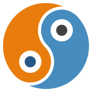

    
    <h1 style="min-width: 200px; text-align: center; font-size: 36px;">B2GD: Blender to Godot</h1>

-----

# Welcome to B2GD Documentation

🫣 You're not supposed to be here! 🫣

B2GD is still in development and the docs are not ready yet!

-----

**B2GD** is a Blender to Godot plugin. It allows to set Godot properties directly
inside Blender, create colliders, navigation and occluders, replace an object with
a scene, etc.

The plugin contains two parts: the Blender extension and the Godot plugin. The source
code is available at GitHub. TODO: add github link (repo isn't done)

[Installing](./install.md)

## Main features

### Geometry options

- Set MeshInstance properties: visual layer, cast shadow, lightmap scale, etc.
- Add colliders: Set collision body type, collision shapes, layers, masks and many more.
- Configure navigation regions and its properties.
- Create occluders for occlusion culling.

### Replace an object by a scene

- Easily replace an object with a scene during import. Simply set the scene path
or UID on the B2GD panel.

<!-- ### Import bezier curves as a Path3D

- The curve data is saved in the object to create Path3D. -->

## Getting Help

Questions and bug reports can be made on the project's GitHub repository.

TODO add github issues link.

## Support me

<table>
<tr>
    <td>Ko-fi</td>
    <td>
        
    </td>
</tr>
<tr>
    <td>GitHub</td>
    <td>
        <iframe src="https://github.com/sponsors/umaruru/button" title="Sponsor umaruru" height="32" width="114" style="border: 0; border-radius: 6px;"></iframe>
    </td>
</tr>
</table>

